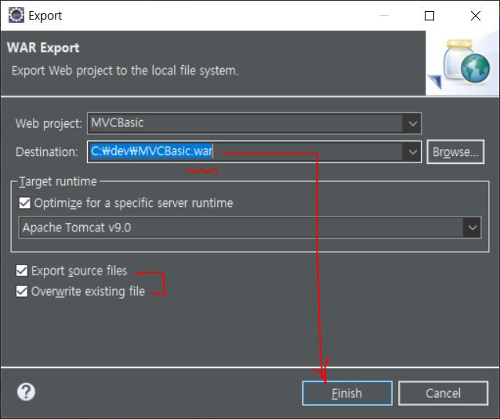
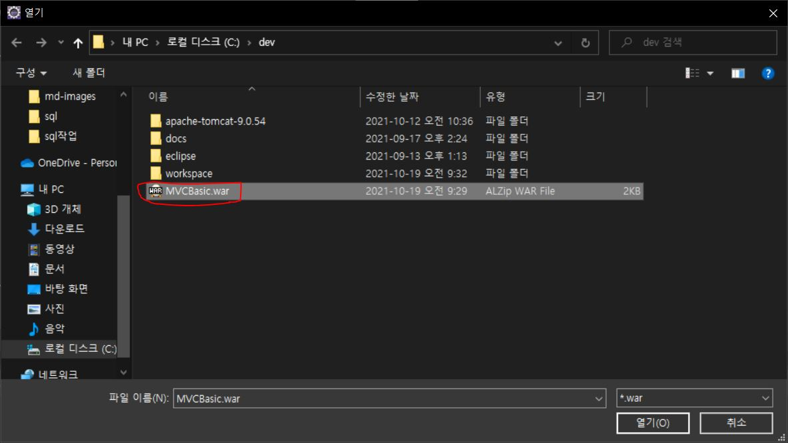

# Eclipse-Export-Import

***

> ### 이클립스를 이용하여 Export와 Import를 해보자.

1. ####  `Project Explorer`에서 Export할 프로젝트를 우클릭 -> `Export` -> `WAR file`

     ### 

2. ####  새로 뜬 창에서 기존 프로젝트 확인 -> `Browser`

     ### 

3. ####  파일 탐색기에서 `Export`할 경로 설정 -> 이때 오류는 확장자(`war`)가 없기 때문

     ### 

4. ####  확장자를 붙여주고 `Finish` -> 여기서 체크박스는 취향껏 체크

     ### 

***

1. ####  `Project Explorer` 우클릭 -> `Import` -> `WAR file`

     ### 

2. ####  새로 뜬 창에서 `Target runtime` 확인 -> `Browser`

     ### 

3. ####  `Export`했던 파일 확인 -> 열기

     ### 

4. ####  파일 추가 확인 -> 오류가 뜨는 이유는 이전에 `Export`했던 프로젝트와 이름이 같기 때문

     ### 

5. ####  이름 수정 -> `Finish`

      ### 

6. ####  `WAR file`을 `Import`한 프로젝트가 생성 확인

      ###  

***

* ### 자바로 `Export / Import`함으로써 모듈들을 더욱 더 효율적으로 관리가 가능하다.