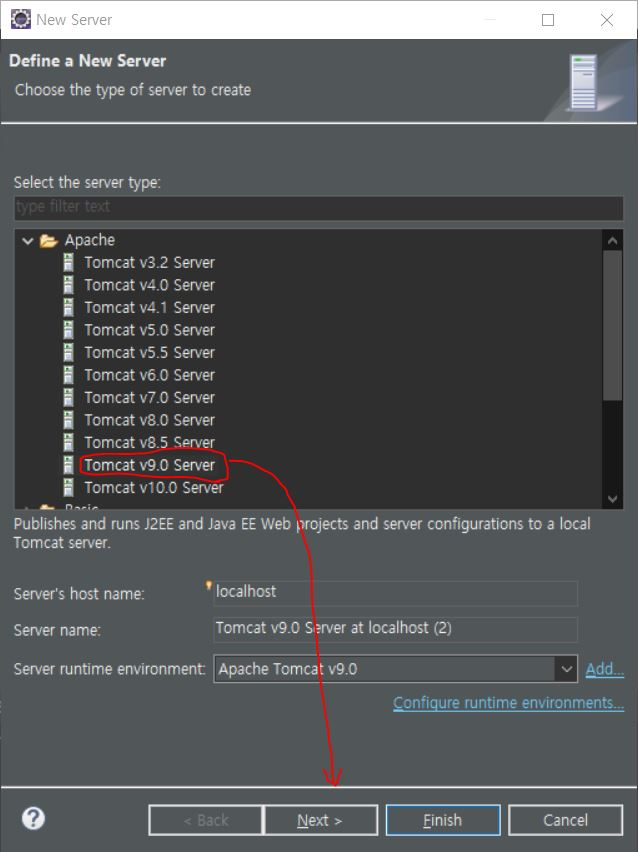
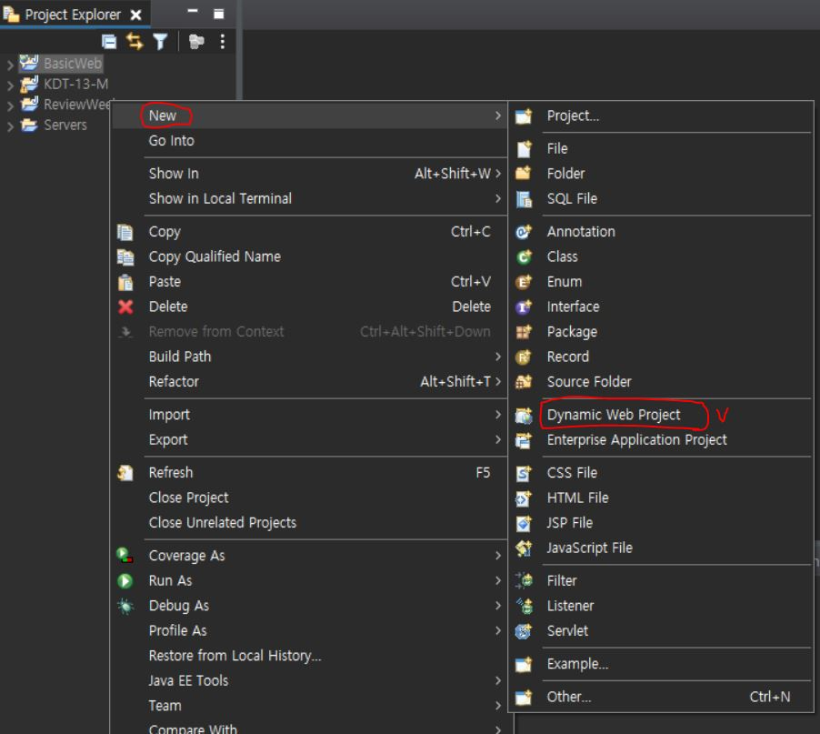

# Eclipse-use-HTML

***

> ### 이클립스를 이용하여 Apache Tomcat 9.0 서버를 만들고 HTML을 실행시켜보자.

1. ####  이클립스 `상단메뉴` -> `Window` -> `Show View` -> `Servers`

     * 만약 `Data Source Explorer`가 없다면, `Other...` -> `Servers` 검색 -> `Open`

2. ####  하단에 생긴 `Servers`탭에 있는 링크 클릭

     ### 

3. ####  새로 뜬 창에서 `Tomcat v9.0 Server` -> `Next`

     ### 

4. ####  `Browse...` -> 미리 다운받은 `apache-tomcat-9.0.54` 찾기 -> `Finish`

     ### 

5. ####  `Servers`탭에 `Tomcat v9.0 Server at localhost` 생성 확인

     ### 

6. ####  좌측 `Project Explorer` 아무곳이나 우클릭 -> `New` -> `Dynamic Web Project` 

     ### 

7. ####  새로 뜬 창에서 `Project name` 적기 -> 나머지 `체크표시` 알맞게 되었는지 확인 -> `Finish`

     ### 

8. ####  `Project Explorer`에 새로 생긴 `BasicWeb` -> `src` -> `main` -> `webapp`안에 `폴더` 생성 -> `폴더`안에 `HTML 파일` 생성

     ### 

9. ####  추가) `HTML 파일` 만드는 법 -> `폴더` 우클릭 -> `New` -> `HTML file` -> `File name` 수정 -> `Next`

     ### 

10. ####  `Templates - [ New HTML File (5) / html 5 ]` 선택 -> `Finish`

      ### 

11. ####  만든 `HTML 파일` -> `<body>` 작성

      ### 

12. ####  `Project Explorer`의 `welcome.html` 우클릭 -> `Run As` -> `1 Run on Server`

      ### 

13. #### 그러면 에러 메시지가 뜬다 ( =`Port 8080`의 중복사용 충돌 메시지 )

      ### 
    

13. #### `Servers` 탭의 `Tomcat v9.0 Server at localhost` 더블 클릭 -> 상단에 나타난 창에서 `Ports` -> `HTTP/1.1`의 `Port Number`를 `9090`으로 수정

      ### 

13. #### `Port Number` 수정 후 -> 다시 `Run As`로 `welcome.html` 실행 -> `URL` 확인 -> 실행 결과 확인

      ### 

***

* ### `localhost`에 서버를 만들어 자바로 `HTML`을 작성하고 그 결과를 보기 쉽게 즉시 확인할 수 있다.

