# Eclipse-use-SQL

***

> ### 이클립스를 이용하여 SQL Developer환경처럼 쿼리문을 실행시켜보자.

1. ####  이클립스 `상단메뉴` -> `Window` -> `Show View` -> `Data Source Explorer`

     * 만약 `Data Source Explorer`가 없다면, `Other...` -> `Data Source Explorer` 검색 -> `Open`

2. ####  하단에 생긴 `Data Source Explorer`창에 있는 `Database Connections` 우클릭

     ### 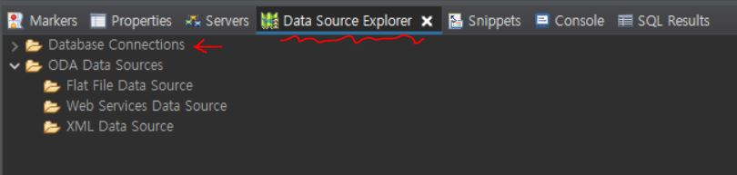

3. ####  새로 뜬 창에서 `Oracle` -> `Next`

     ### 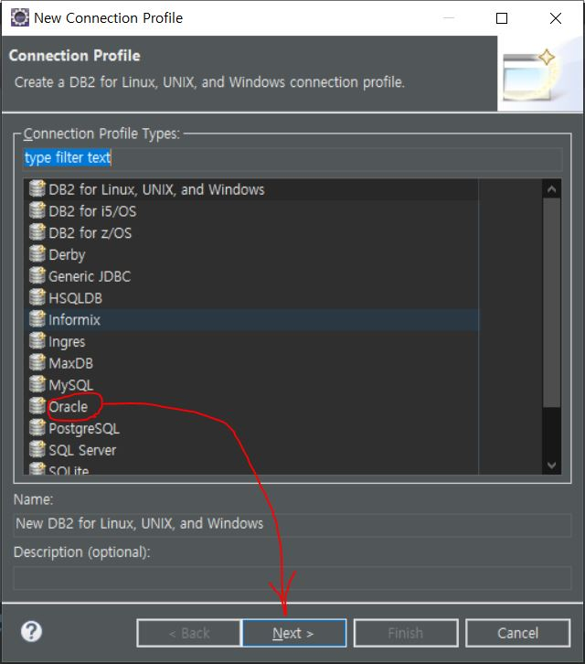

4. ####  우측 상단의 `아이콘` 클릭

     ### 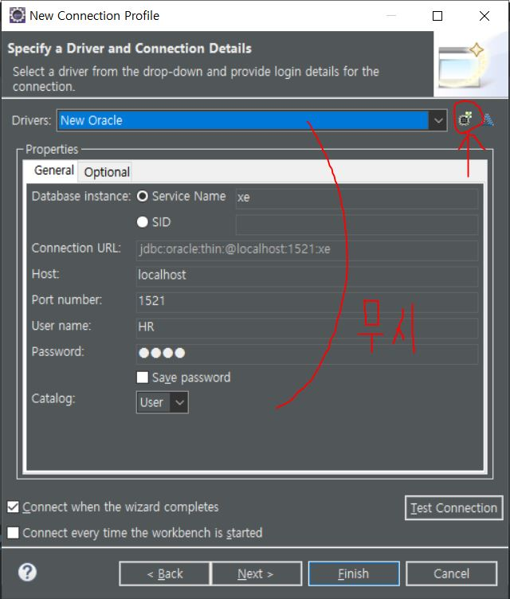

5. ####  노란색 라인 클릭 -> `Driver name` 수정 -> `JAR List`로 이동

     ### 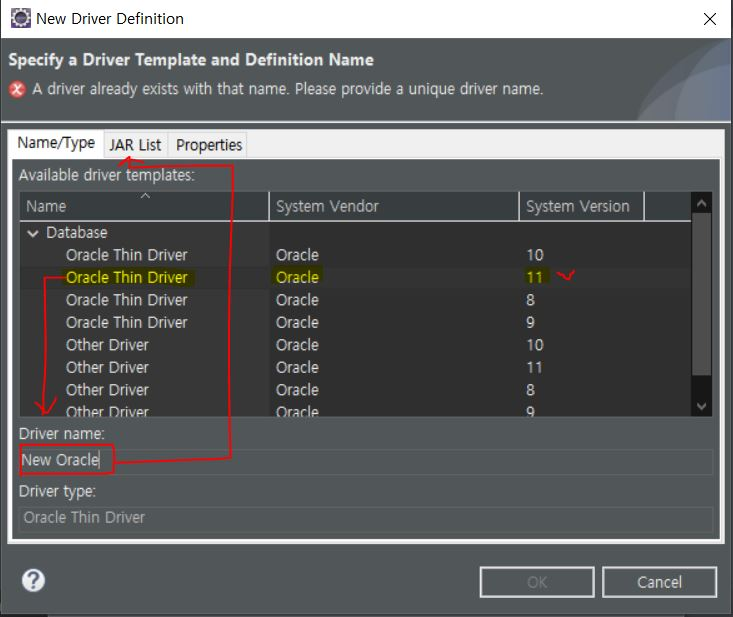

6. ####  기존에 있는 `ojdbc14.jar`은  `Clear All`을 눌러 삭제 -> `Add JAR/Zip...` 클릭 

     ### 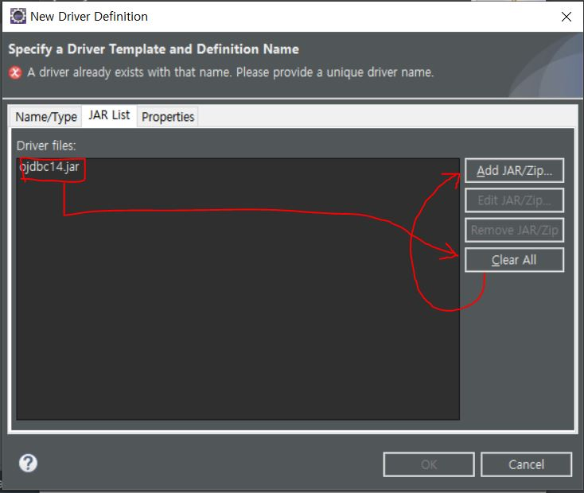

7. ####  파일탐색기로 미리 다운받아 두었던 `ojdbc6.jar`을 찾아서 추가 -> `Properties`로 이동

     ### 

8. ####  `자신의 DB 정보`로 수정 -> `OK`

     ### 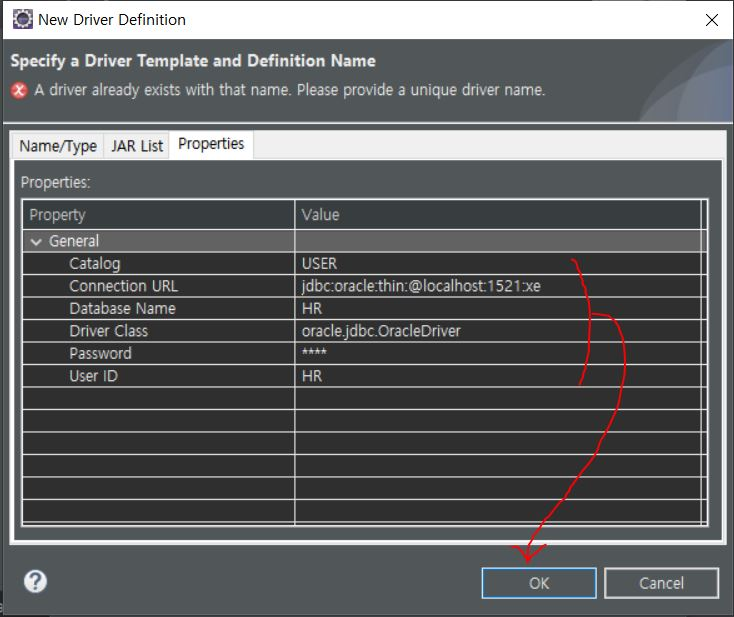

9. ####  최종 확인 -> `Test Connection` 확인 -> `Finish`

     ### 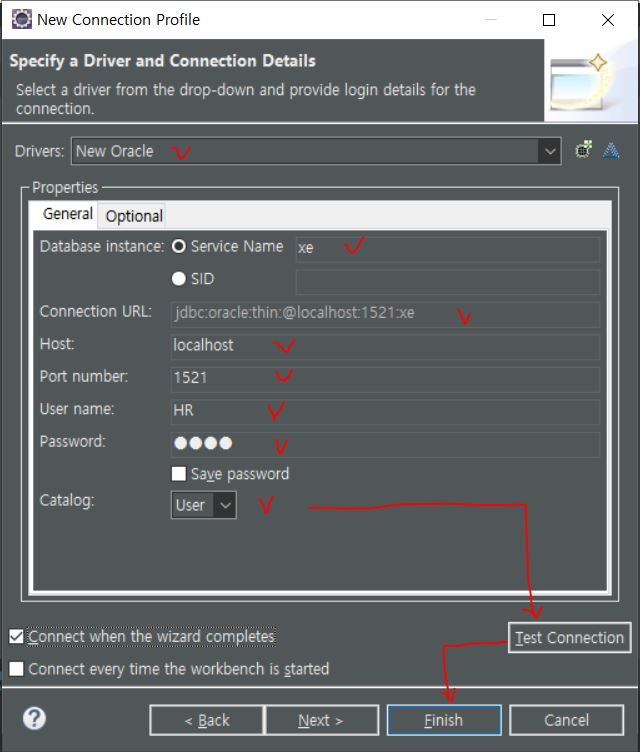

10. ####  새로 생긴 `New Oracle` 우클릭 -> `Open SQL Scrapbook`

      ### 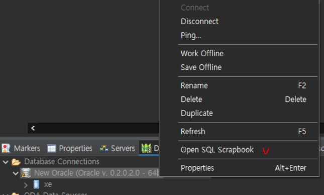

11. ####  상단의 `SQL Scrapbook/Connection profile` 선택 -> `쿼리문` 입력

      ### 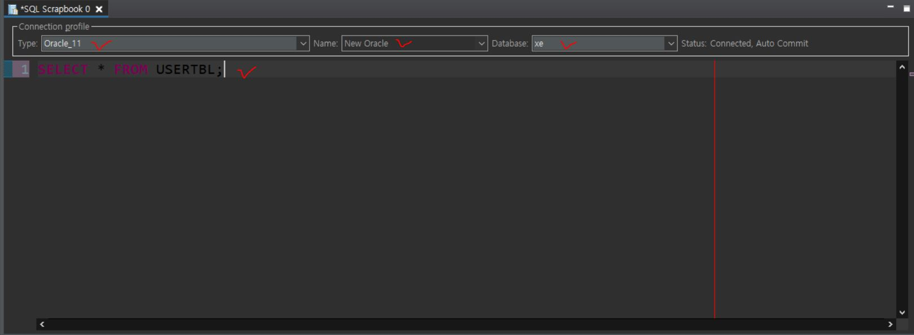 

12. ####  `쿼리문` 드래그 & 우클릭 -> `Execute Selected Text`

      ### 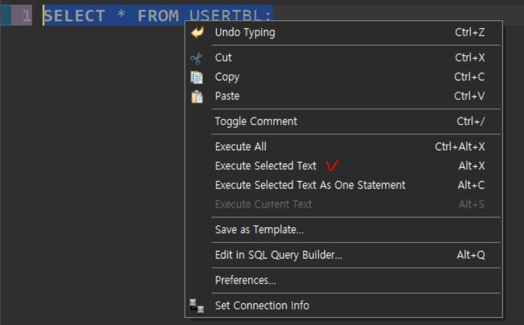

13. #### `쿼리문` 실행 결과 및 로그 확인

      ### 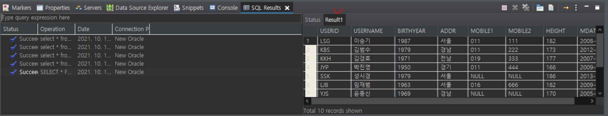
    
    

***

* ### 자바로 DB를 조작한 후에 `별도로 SQL Developer를 실행시킬 필요 없이`, `Read할 필요 없이` 결과를 보기 쉽게 확인할 수 있다.