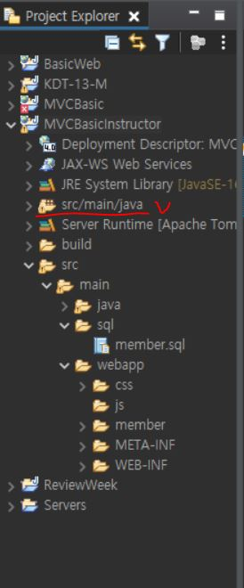
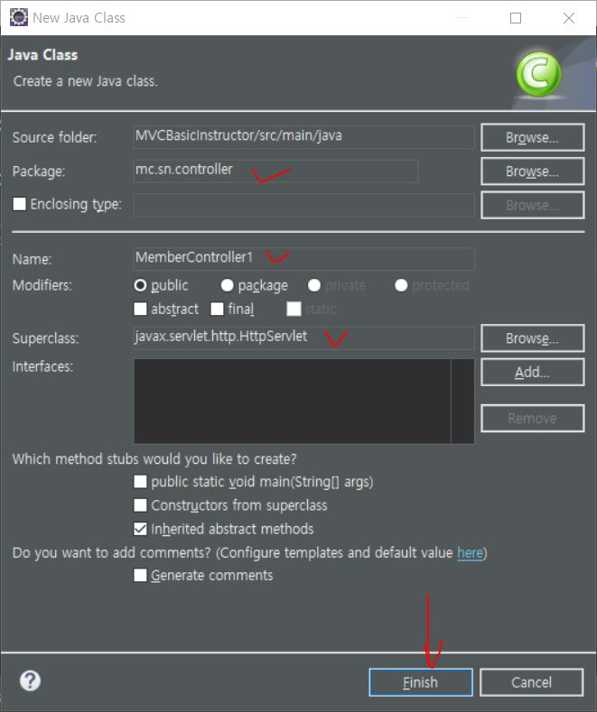

# JAVA-use-Servlet

***

> ### 자바를 이용하여 Servlet을 활용해보자.

1. ####  `Dynamic Web Project` 생성 -> `src/main/java` -> 패키지 생성

     ### 


2. ####  생성된 패키지에  클래스 생성

     ### 


3. #### 클래스 생성시 `Superclass` 우측에 `Browser` 클릭

     ### 


4. ####  `HttpServlet` 검색 및 선택 -> `OK`

     ### 


5. #### `Package, Name, Superclass` 확인 -> `main` 체크 안하고 `Finish`

     ### 


6. ####  `HttpServlet`을 상속받은 클래스 생성 확인

     ### 


7. #### 클래스에 들어갈 코드
```java
public class MemberController extends HttpServlet {

	@Override
	protected void doGet(HttpServletRequest req, HttpServletResponse resp) throws ServletException, IOException {
		// req은 input + resp은 output 개념
		// get으로 들어와도 post를 실행
		this.doPost(req, resp);
	}

	@Override
	protected void doPost(HttpServletRequest req, HttpServletResponse resp) throws ServletException, IOException {
		// 보내는 곳에 "나는 html 타입의 UTF-8 형식 데이터를 보낼거야" 라는 뜻
		resp.setContentType("text/html;charset=UTF-8");
		// 한글 허용
		req.setCharacterEncoding("UTF-8");
		// "내가 브라우저에 뭘 좀 쓰고싶은데 스트림 만들어줘" 라는 뜻
		PrintWriter out = resp.getWriter();
		// jsp의 name 값들에 대응하는 value 값을 가져옴
		String id = req.getParameter("id");
		String pwd = req.getParameter("pwd");
		String name = req.getParameter("name");   
    }
}
```


***


* ### 자바로 `MVC`를 활용하기 위해 `View`에서 입력받은 값을 서버에서 로직 처리하는 기술 단위가 `Servlet`이다.