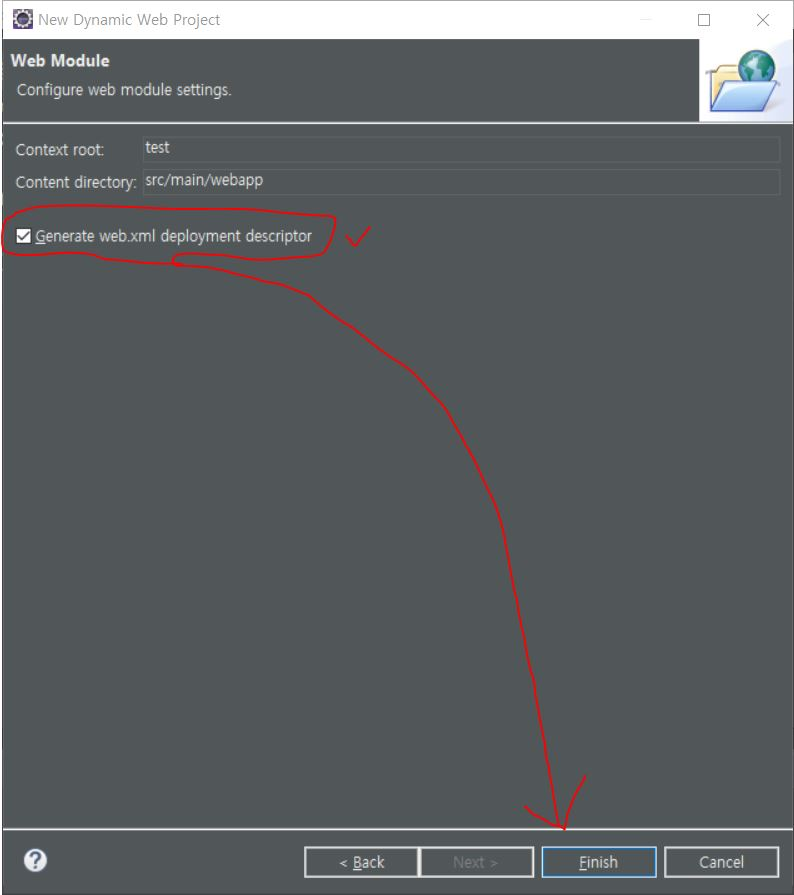
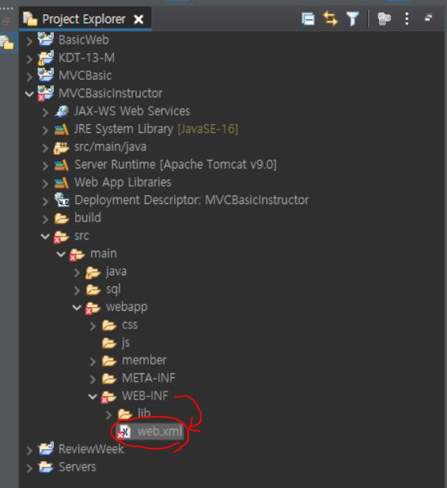

# Servlet-XML

***

> ### Servlet의 환경설정을 해주는 XML에 대해 알아보자.

1. ####  우선 `Dynamic Web Project` 생성시, 마지막 페이지의 `Generate web.xml deployment descriptor` 체크 -> `Finish`

     ### 


2. ####  프로젝트의 `src/main/webapp/WEB-INF/web.xml` 생성 확인

     ### 


3. ####  `XML`내부 코드

```xml
<?xml version="1.0" encoding="UTF-8"?>
<web-app xmlns:xsi="http://www.w3.org/2001/XMLSchema-instance" xmlns="http://xmlns.jcp.org/xml/ns/javaee" xsi:schemaLocation="http://xmlns.jcp.org/xml/ns/javaee http://xmlns.jcp.org/xml/ns/javaee/web-app_4_0.xsd" id="WebApp_ID" version="4.0">
  <display-name>MVCBasic</display-name>
  <welcome-file-list>
    <welcome-file>index.html</welcome-file>
    <welcome-file>index.htm</welcome-file>
    <welcome-file>index.jsp</welcome-file>
    <welcome-file>default.html</welcome-file>
    <welcome-file>default.htm</welcome-file>
    <welcome-file>default.jsp</welcome-file>
  </welcome-file-list>
  
  <!-- 추가부분 -->
  <servlet>
  	<servlet-name>controller</servlet-name>
  	<servlet-class>mc.sn.controller.MemberController</servlet-class>
  </servlet>
  <servlet-mapping>
  	<servlet-name>controller</servlet-name>
  	<url-pattern>/CmdController</url-pattern>
  </servlet-mapping>
  <!-- 추가부분 -->
  
</web-app>
```


***


* ### `XML`은 자바로 `MVC`를 하기 위한 환경 설정 파일이며, 후에 자바에 쓰일 `Query`문을 이곳에 저장하기도 한다.