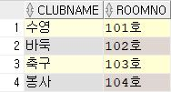

# INNER-JOIN

***

* ## **stdTBL**

 

* ## **stdclubTBL**

 

* ## **clubTBL**

 

***

* ## 여러 개의 테이블 합치기

  * ### INNER JOIN : 조건과 일치하는 레코드만

> `SELECT [속성] FROM [테이블명1] INNER JOIN [테이블명2] ON [조인조건]`

```sql
-- INNER JOIN
SELECT S.STDNAME, S.ADDR, C.CLUBNAME, C.ROOMNO          -- 추출할 속성들
FROM stdTBL S
    INNER JOIN stdclubTBL SC
    ON S.STDNAME = SC.STDNAME
    INNER JOIN clubTBL C
    ON SC.CLUBNAME = C.CLUBNAME;
    
    
    
    
    
-- SELF JOIN
SELECT ~~@@
```

* **실행 결과**

 

***

