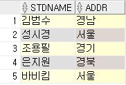
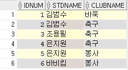
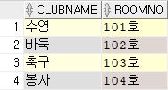
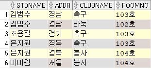

# INNER-JOIN

***

* ## **stdTBL**

 

* ## **stdclubTBL**

 

* ## **clubTBL**

 

***

* ## 여러 개의 테이블 합치기

* ### INNER JOIN : 조건과 일치하는 레코드만

> `SELECT [속성] FROM [테이블명1] INNER JOIN [테이블명2] ON [조인조건]`

```sql
-- INNER JOIN
SELECT S.stdname, S.addr, C.clubname, C.roomno      -- [stdTBL]의 [stdname, addr] + [clubTBL]의 [clubname, roomno]
FROM stdTBL S
    INNER JOIN stdclubTBL SC                        
    ON S.stdname = SC.stdname                       -- [stdTBL]과 [stdclubTBL]에 [stdname]이 일치하는 레코드만 추출
    INNER JOIN clubTBL C
    ON SC.clubname = C.clubname;                    -- [stdclubTBL]과 [clubTBL]에 [clubname]이 일치하는 레코드만 추출
```

* **실행 결과**

 

***

* ### SELF JOIN : 주로 서로의 관계성이 여러 개일 때 사용 ( `INNER JOIN` 활용 )

  * ##### ex) `[A]`와 `[B]`는 회사의 `[직원]`이고 `[A]`는 `[B]`의 `[상관]`이다. 이럴 때 `[A]`는 `[직원]`과 `[상관]`의 두 가지 관계성을 띈다.

```sql
-- SELF JOIN
SELECT EMP.name, EMP.eid, MGR.name, MGR.eid        -- [employees]의 [name, eid, name, eid] = 결국 같은 테이블 속성들임
FROM employees EMP
    INNER JOIN employees MGR
    ON MGR.eid = EMP.mid
    WHERE emp.name = 'KIM';                        -- [employees]에서 [name]은 'KIM'이란 직원의 [eid]가 [mid]인 레코드를 추출
    
-- 결과 : 'KIM'이란 직원의 [name] + [eid] / 'KIM'직원의 [mid]를 가진 상관의 [name] + [eid] 출력
```

***

