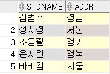

# OUTER-JOIN

***

* ## **stdTBL**

 

* ## **stdclubTBL**

 

* ## **clubTBL**

 

***

* ## 여러 개의 테이블 합치기

  * ### OUTER JOIN : 조건과 일치하지 않는 레코드도 포함

> `SELECT [속성] FROM [테이블명1] OUTER JOIN [테이블명2] ON [조인조건]`

```sql
-- ( FULL = LEFT + RIGHT )로 볼수 있음
SELECT S.STDNAME, S.ADDR, C.CLUBNAME, C.ROOMNO          -- 추출할 속성들
FROM stdTBL S

    FULL OUTER JOIN stdclubTBL SC                       -- LEFT JOIN 사용시 = line7:[성시경] 포함
                                                        -- RIGHT JOIN 사용시 = line7:[성시경] 미포함
    ON S.STDNAME = SC.STDNAME
    
    FULL OUTER JOIN clubTBL C                           -- LEFT JOIN 사용시 = line7:[성시경] 포함 / line8:[수영] 미포함
                                                        -- RIGHT JOIN 사용시 = line7:[성시경] 미포함 / line8:[수영] 포함
    ON SC.CLUBNAME = C.CLUBNAME;
```

* **실행 결과**

 

***

